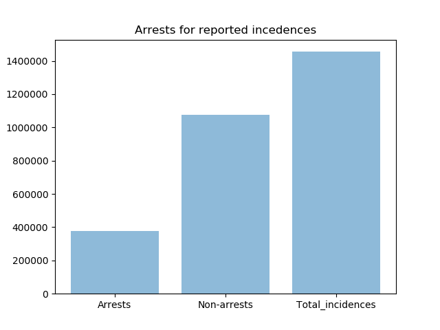
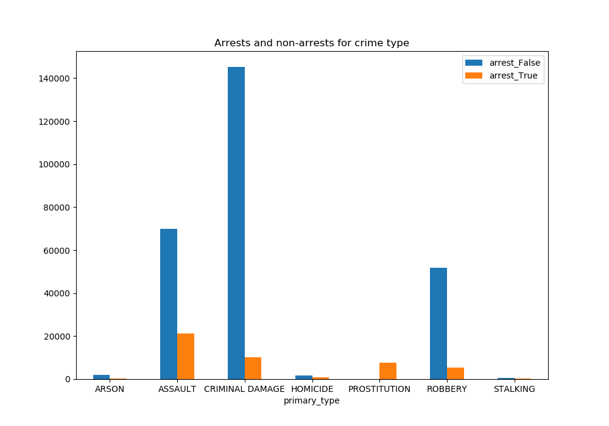
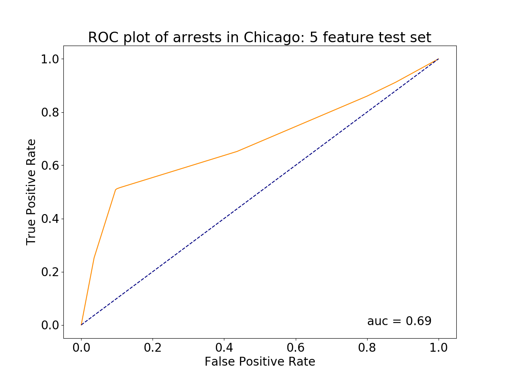
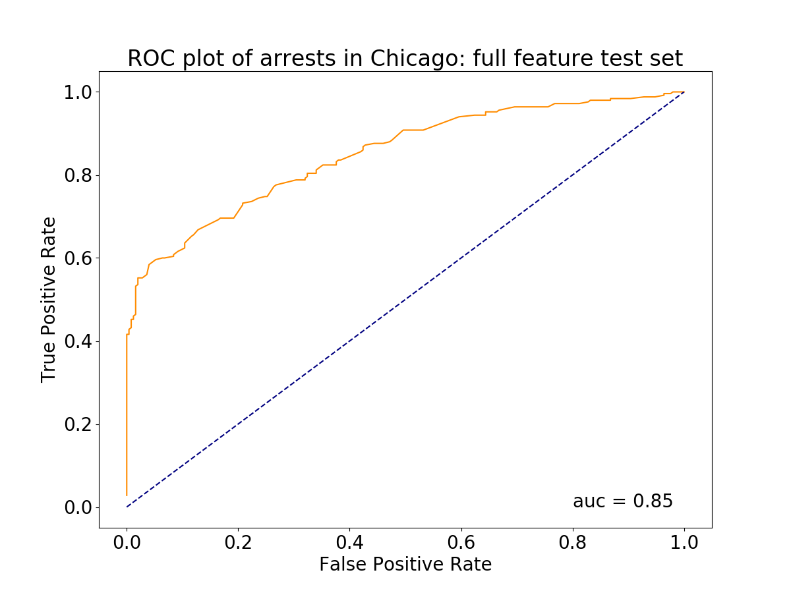
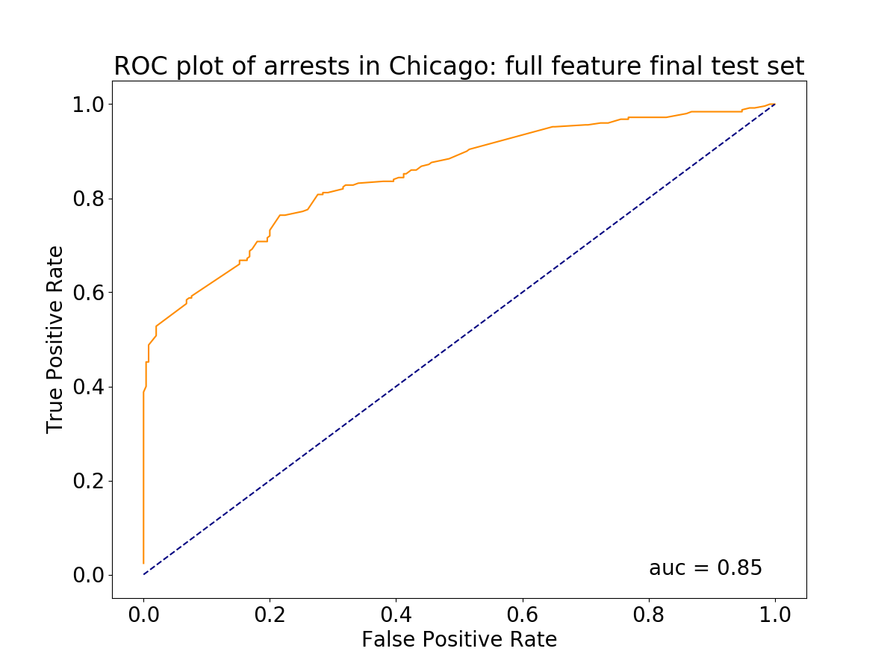
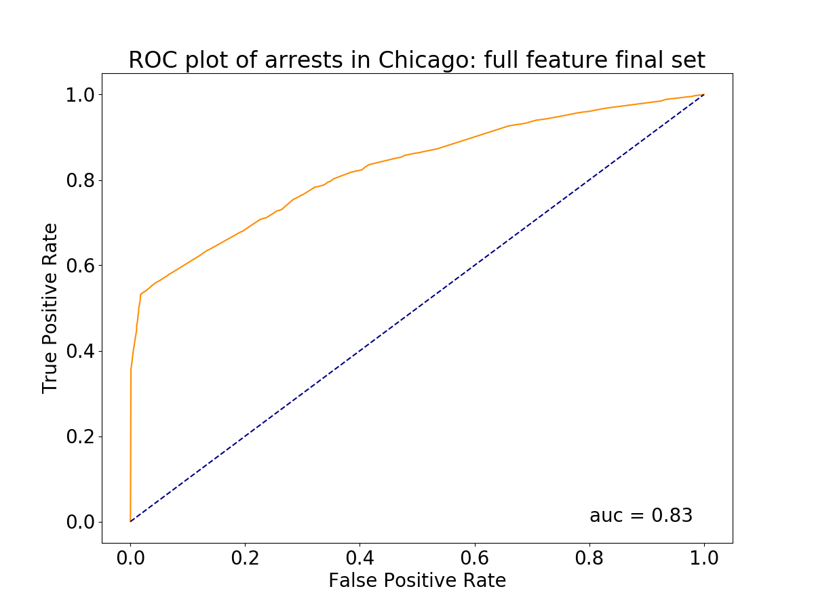

## Introduction
  Chicago has a long history of gang violence and high crime rates. In recent years the rate has rapidly increased, especially on it's notoriously dangerous South side. With the increase in crime rate and attention from the media, rumors on the police force have grown. For example, it has been discussed that police are avoiding the South side for protection reasons. I was interested in exploring crime data to see what I could uncover. I quickly saw the differences in arrests vs. non-arrests in different areas as well as for different crime types. So, my question is:

  Given a type of crime and area, can I predict if that person was arrested or not?

## Data
  This data was pulled from Kaggle. It contained crime data representing Chicago from 2012-2017. The data contained various types of locations: wards, districts, Blocks, Location Description, Community Area, etc. It also contained other notable information such as Primary crime type, Beat, IUCR (Illinois crime code), if the crime was domestic, and if there was an arrest made. Most of the data fields are categorical, excluding longitude, latitude, and time. For this analysis, I will stick with only the categorical variables.

  The unique item counts by variable:
    Block: 32774
    Primary Type: 33
    Beat: 302
    District: 24
    Ward: 50
    Community Area: 78
    Arrest: 2 (True/False)
    location_description: 142
    domestic: 2 (True/False)
    iucr: 365
    beat:302

## Data cleaning
  The data was fairly void of null values. Checking all data types, unique values, and running a msno null map, I found that there was only ~200 rows containing any sort of null values. I decided to drop these rows as the entire data set is over 1.4 million rows in length. Next, I cleaned up cases and special characters to avoid typing and calling errors. I then changed all True false values to 1 and 0 respectively. Overall, this was a clean data set to begin with. The main challenge was grouping and organizing the necessary dummy variables.

## Exploratory Data Analysis

Note that because I am hoping to predict arrests, these classes are imbalanced.

## Model
I approached this question by first creating a small test set so computing time wasn't too long and choosing a location type (ward), all primary crime types, and the variable 'Domestic', which noted if the crime was a domestic situation. I first explored by grouping primary crime types into two groups, violent and nonviolent. I then grouped the 50 wards into 2 groups of 25, north and south Chicago. Domestic stayed as is since it was a true/false (1/0) value. Each of these grouping were broken up into dummy variables with 0/1 values to give a total of 5 features. I then created a logistic regression model and plotted it's ROC curve to visualize the true positive and False positive rates.

|score|
---|---
|accuracy | 0.70

Plot 2:

I opened up the features I used previously and expanded each crime to into its own dummy variable as well as made smaller subgroups for wards, 10 groups of 5, selected by their close proximity to each other. 44 features total. I plotted another ROC  curve and found and increased AUC, however, this is likely over fit. I decided to stick with these features and begin feature engineering.

score|
---|---
accuracy | 0.756

From here I made a logistic regression model with an L1 penalty to identify coefficients that don't have a large predictive impact on my model. The features corresponding to the zeroed out coefficients were discarded. Some of these coefficients represented a very small amount of the total number of crimes. Note that 4 locations were discarded.

Feature index|
---|---
2| Arson
6| Concealed carry violation
12| Homicde
13| Human trafficking
15| Intimidation
16| Kidnapping
20| Non-criminal
21| Non_criminal
22| Non-criminal(subject-specified)
23| Obscenity
24| Offense involving children
25| Other narcotic violation
28| Public Indecency
31| Sex offenses
32| Stalking
39| Ward 4
40| Ward 5
42| Ward 7
43| Ward 8

I then checked for multicollinearity issues with VIF values after the prior features were discarded.

VIF values|
---|---
domestic| 1.69
assault| 1.09
battery| 1.7
burglary| 1.06
crim_sexual_assault| 1.0
criminal_damage| 1.12
criminal_trespass| 1.06
deceptive_practice| 1.04
gambling| 1.0
interference_with_public_officer| 1.0
liquor_law_violation| 1.0
motor_vehicle_theft| 1.06
narcotics| 1.07
other_offense| 1.13
prostitution| 1.0
public_peace_violation| 1.01
robbery| 1.02
theft| 1.19
weapons_violation| 1.02
ward_1| 1.08
ward_2| 1.1
ward_3| 1.19
ward_4| 1.15
ward_7| 1.14
ward_10| 1.25

Plot 3:

Made a final model with these identified features on my reduced test set, (2000 rows). Here I used the wrong size data set by mistake. I inputted the same size as my test data sets but should have included a 25% split from the original balanced set.

score|
---|---
accuracy | 0.752

Plot 4:

Applying model to the hold out set, (752912 rows). Here I am treating the remainder of my balanced data set as the hold out set. This should have been smaller, roughly 50% of the original data and the data set to train and form my model with.

score|
---|---
accuracy | 0.751

## Discussion
  Two main errors made: 1) incorrect split, fitting, and testing of my balanced input data set. 2) I would like to perform VIF before running a logistic regression with an l1 penalty. I feel following these steps will yield a more generalizable model as multicollinearity will be addressed up front and the training and hold out proportion will be more representative of the full data set.

#### Improving the model
  In this model, I only explored one location type and as seen, multiple ward groups were discarded. I would like to test a models on the different types of locations as well as combinations of those locations. Additionally, pulling in another data set with comprehensive demographics of each location might give more insight. Creating a model with variables such as income, ethnicity, a count of gangs by area, police activity, etc. could possibly be more descriptive of arrests, rather than just purely based off of location. This data set also included date and time down to the hour. It would be interesting to see if different times in the day yielded better predictive power.
